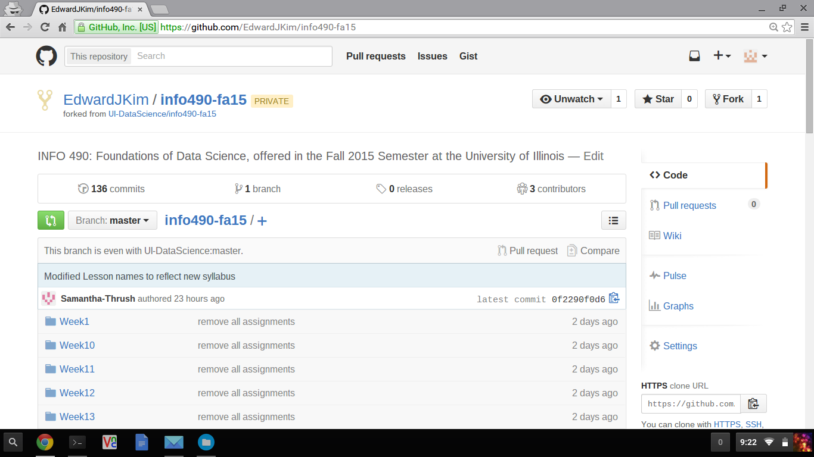
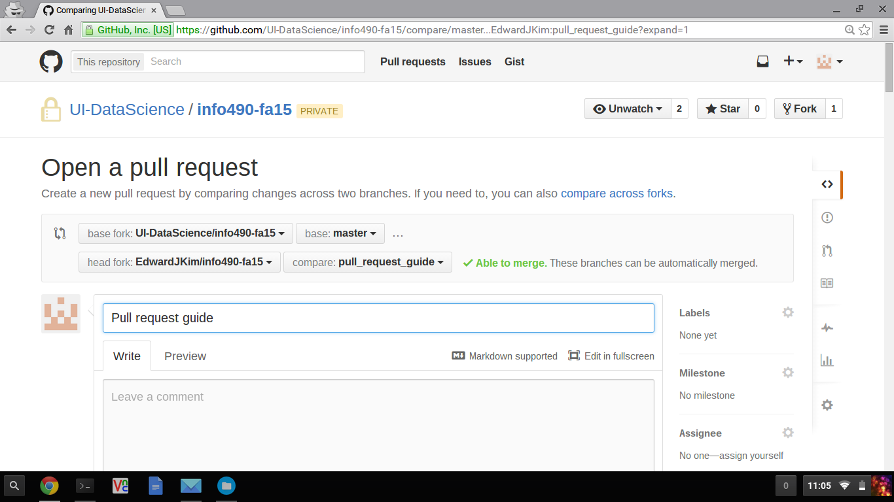

# How to Do a GitHub Pull Request

If you would like to request or suggest a change in the course material on our GitHub repository, use [pull requests](https://help.github.com/articles/using-pull-requests/) (PRs).

You are reading one of the lessons and assignments on our course GitHub repository, and you find a typo. Or, one of the code cells in a notebook does not work, and you know how to fix it. You could email one of the instructional staff or ask in the Q&A forum, but the recommended way is to use a more sophisticated approach and submit a pull request (PR). In the following, I will walk you through the steps for creating the PR that added [How to Do a GItHub Pull Request](CONTRIBUTING.md) to our course repository.

The basic steps are: (some are optional, but I recommend that you do all the steps.)

1. [Fork](https://help.github.com/articles/fork-a-repo/) the course repository.
2. [Clone](https://git-scm.com/book/en/v2/Git-Basics-Getting-a-Git-Repository) your forked repository.
3. [Sync](https://help.github.com/articles/syncing-a-fork/) your fork with the original course repsitory.
4. Create a [branch](https://git-scm.com/book/en/v2/Git-Branching-Basic-Branching-and-Merging).
5. Make changes.
6. [Stage and commit](https://git-scm.com/book/en/v2/Git-Basics-Recording-Changes-to-the-Repository) the changes.
7. [Push](https://git-scm.com/book/en/v2/Git-Basics-Working-with-Remotes) the changes to your fork.
8. Submit a pull request.

## Detailed Example

I will do this in the command line, but once you understand the flow, you can also use the [GitHub Desktop](https://desktop.github.com/). Note also that more detailed guide can be found elsewhere (e.g. on [GitHub](https://help.github.com/)). The following example uses our course repository.

### 1. Fork the course repoistory.

First, you go to our [course repository](https://github.com/UI-DataScience/info490-fa15), and fork the course repository by clicking `Fork` in the upper right corner.


Now, notice that your copy of the repository has your username, and it says `forked from UI-DataScience/info490-fa15`.



### 2. Clone the forked repository.

At the Unix shell, use `git clone` to clone the **forked** repository (the one with your username in it; you should obviously change `EdwardJKim` to your username). Change into the new directory.

```shell
$ git clone https://github.com/EdwardJKim/info490-fa15
$ cd info490-fa15
```

The `git status` command shows any changes you make in this directory. Since we have not made any changes or commits in this directory, it says your working directory is clean.

```shell
$ git status
On branch master
Your branch is up-to-date with 'origin/master'.

nothing to commit, working directory clean
```

### 3. Sync your fork with the original course repsitory.

This is perhaps optional, but imagine that while you are making your own changes, someone else makes a change in the original course repository. You would want to [sync your fork](https://help.github.com/articles/syncing-a-fork/) to keep your copy updated. So we will add the upstream to keep track of the changes in the original repository. You can use `git remote` to see which GitHub repositories are tracked in your local Git repository.

```shell
$ git remote -v
origin  https://github.com/EdwardJKim/info490-fa15 (fetch)
origin  https://github.com/EdwardJKim/info490-fa15 (push)
```

It seems that only the fork is tracked here. Let's use `git remote` to also track the original UI-DataScience repository.

```shell
$ git remote add upstream https://github.com/UI-DataScience/info490-fa15
$ git remote -v
origin  https://github.com/EdwardJKim/info490-fa15 (fetch)
origin  https://github.com/EdwardJKim/info490-fa15 (push)
upstream        https://github.com/UI-DataScience/info490-fa15 (fetch)
upstream        https://github.com/UI-DataScience/info490-fa15 (push)
```

#### 4. Create a branch.

This is also optional because you can always work on your `master` and send a PR to UI-DataScience's `master`, but I think it's good practice to create a seprate branch for each distinct feature change. Let's first create a branch named `pull_request_guide`.

```shell
$ git branch pull_request_guide
```

Not we want to move into this branch with `git checkout` before making changes.

```shell
$ git checkout pull_request_guide
Switched to branch 'pull_request_guide'
```

Note that these two commands can be combined in one line:

```shell
$ git checkout -b pull_request_guide
Switched to a new branch 'pull_request_guide'
```

If you check again with `git status`, you will notice that it says you are now on branch `pull_request_guide`. (In step 2, `git status` said you are in the `master` branch.)

```
$ git status
On branch pull_request_guide
nothing to commit, working directory clean
```

### 5. Make changes.

In this example, I created a new file named `CONTRIBUTING.md`. For IPython/Jupyter notebooks, you will probably have to make changes elsewhere (i.e. on your web browser using Jupyter server) and copy the modified file to this Git directory.

Git tracks all changes I have made since the last commit. You can check what the changes are using `git status`.

```shell
$ git status
On branch pull_request_guide
Untracked files:
  (use "git add <file>..." to include in what will be committed)

        CONTRIBUTING.md

nothing added to commit but untracked files present (use "git add" to track)
```

### 6. Stage and commit the changes.

Stage the changed file with `git add`.

```shell
$ git add CONTRIBUTING.md
```

I also need some images, so I created 4 images, and now `git status` shows:

```shell
$ git status
On branch pull_request_guide
Changes to be committed:
  (use "git reset HEAD <file>..." to unstage)

        new file:   CONTRIBUTING.md

Untracked files:
  (use "git add <file>..." to include in what will be committed)

        images/pull_request_0.png
        images/pull_request_1.png
        images/pull_request_2.png
        images/pull_request_3.png
```

You can stage multiple files before you make a commit. Let's stage the 4 images as well

```shell
$ git add images/pull_request_0.png
$ git add images/pull_request_1.png
$ git add images/pull_request_2.png
$ git add images/pull_request_3.png
```

The `git status` now shows that 5 files have been staged:

```shell
$ git status
On branch pull_request_guide
Changes to be committed:
  (use "git reset HEAD <file>..." to unstage)

        new file:   CONTRIBUTING.md
        new file:   images/pull_request_0.png
        new file:   images/pull_request_1.png
        new file:   images/pull_request_2.png
        new file:   images/pull_request_3.png
```

After you have staged all the files you would like to be in a commit, use `git commit` to commit the changes.

```shell
$ git commit -m "Add instructions on how to submit a pull request"
[pull_request_guide cce961b] Add instructions on how to submit a pull request
 5 files changed, 198 insertions(+)
 create mode 100644 CONTRIBUTING.md
 create mode 100644 images/pull_request_0.png
 create mode 100644 images/pull_request_1.png
 create mode 100644 images/pull_request_2.png
 create mode 100644 images/pull_request_3.png
```

### 7. Push the changes to your fork.

Use `git push` to upload the changes made in the local repository to your GitHub repository.

```shell
$ git push origin master
```

### 8. Submit a pull request.

Now the final step: actually submitting a pull request. Open your web browser, and go back to your fork. I pushed the `pull_request_guide` in step 7, so GitHub repository now shows an option to **Compare & pull request**. Click it.


Before you submit, you can review the changes and comment on the PR. If it is a simple PR like a typo fix, it will probably be accepted quickly after it is reviewed by the instuctional staff. If it is code change, the PR will likely start a discussion before it is finally accepted, so please try to describe clearly what the PR is about in the comments.



### 9. Delete the branch.

This is optional, but after your PR is merged or closed, you can delete the branch. See [Deleting unused branches](https://help.github.com/articles/deleting-unused-branches/).


This document was actually posted as a PR. See [the PR on how to submit a pull request](https://github.com/UI-DataScience/info490-fa15/pull/1) that pushed this file to the course repository.
