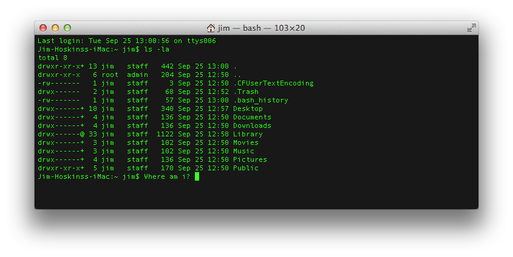

#Week 2 Overview#

## Introduction to Command-Line Data Science ##

In this week, you will first be delving further into Unix concepts, such as commands, input/output redirection, and the unix shell.  Secondly, you will be learning about iPython Notebooks and how to utilize them in this course.  Finally, you will be going through the basics of the Python language and learning about different types of Python errors, different data types within Python, as well as how to do simple manipulations of Python variables.

### Objectives ###

#####By the end of this lesson, you should be able to:######

- Understand how to utilize various Unix commands.
- Execute Python commands in an IPython notebook.
- Know basic Python terminology, such as input, output, debugging, etc.
- Perform basic operations on Python variables.

### Activities and Assignments ###

|Activities and Assignments | Time Estimate | Deadline* | Points|
|:------| -----|-------|----------:|
|**[Week 2 Introduction Video](** | 10 Minutes | Tuesday |20|
|**[Week 2 Lesson 1: Basic Unix Concepts](lesson1.md)**| 3 Hours |Thursday| 20|
|**[Week 2 Lesson 2: Introduction to iPython](lesson2.md)**| 2 Hours | Thursday | 20 |
|**[Week 2 Lesson 3: Introduction to Python](lesson3.md)**| 2 Hours | Thursday| 20 |
|**Week 2 Quiz**| 30 Minutes | Friday | 70|
|**Week 2 Assignment Submission to Instructor**| 3 Hours | Saturday | 60 | 
|**Week 2 Assignment Submission for Peer Grading**| 3 Hours | Sunday | 40 | 
|**Week 2 Assignment Submission of Peer Review**| 3 Hours | *Next* Saturday | 50 | 

*Please note that unless otherwise noted, the due time is 6pm Central time!

----------

Photo Credit: Command Line Screen Shot by Jim Hoskins. 27 Sept. 2012. http://blog.teamtreehouse.com/introduction-to-the-mac-os-x-command-line. 31 July 2015
